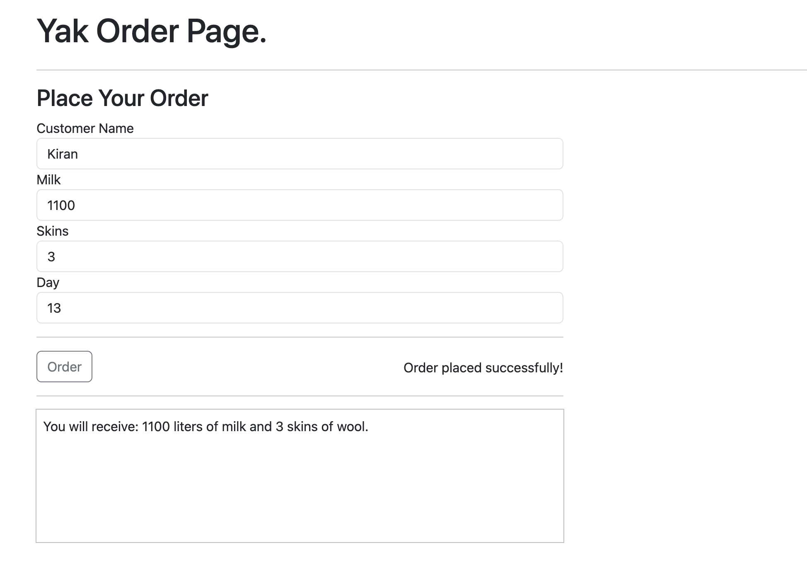

# Yak Shop
This is a solution for the Yak Shop problem. The solution is written in Go and uses the [echo](https://echo.labstack.com/docs/routing) and [cobra](https://github.com/spf13/cobra) cli.

For the unit tests assertions, I have used both testify and cupaloy. The reason for this is that I wanted to try out cupaloy. It is a snapshot testing library for Go. It is similar to Jest snapshot testing. It is very easy to use and it is very useful for testing the JSON responses.

## Requirements
* [Go](https://golang.org/doc/install)
* [Git](https://git-scm.com/downloads)

## Installation
Run the following command to install the dependencies:
```
go mod tidy
```


## Run the tests
```
go test ./...
```
<div class="warning" style='padding:0.1em; background-color:#E9D8FD; color:#69337A'>
<span>
<p style='margin-top:1em; text-align:center'>
<b>On the importance of testing the endpoints</b></p>
<p style='margin-left:1em;'>
While testing the REST endpoints, make sure to execute the load endpoint first. Otherwise, you will get an empty response from the other endpoints.
</p>
</span>
</div>

## User Story 1
YAK-1: As a Yak Shepherd, I want to be able to read in a XML file that contains data about my herd so that I can query it.

Input herd.xml:
```xml
<herd>
<labyak name="Betty-1" age="4" sex="f" />
<labyak name="Betty-2" age="8" sex="f" />
<labyak name="Betty-3" age="9.5" sex="f" />
</herd>
```

N.B. The age is given in standard Yak years. Your program should take 2 parameters:
• The XML file to read
• An integer T, representing the elapsed time in days

## Solution
Run the program with the following command:
```
go run cmd/main.go -f ./data/herd.xml -T 13
```

Output
```
In Stock:
        1104.480 liters of milk
        3 skins of wool
Herd:
        Betty-1 4.13 years old
        Betty-2 8.13 years old
        Betty-3 9.63 years old
```

## User Story 2
YAK-2: As a Yak Shepherd I want to be able to load a new Herd into my webshop using an HTTP REST service so that I can open my webshop.I want to be able to run my webshop and load my herd into it. Once I load a herd, any previous state of my webshop should be reset to the initial state. The following are the HTTP requests I want to make:

POST /yak-shop/load which returns a HTTP Status Code
205 (Reset Content)

## Solution

Request:
```http
POST http://localhost:8080/yak-shop/load
Content-Type: application/xml

<herd>
<labyak name="Betty-1" age="4" sex="f" />
<labyak name="Betty-2" age="8" sex="f" />
<labyak name="Betty-3" age="9.5" sex="f" />
</herd>
```

Response:
```http
HTTP/1.1 205 Reset Content
Vary: Origin
Date: Fri, 27 Oct 2023 17:38:02 GMT
Content-Length: 0
Connection: close
```

## User Story 3
YAK-3: As a Yak Shepherd I want to be able to query my herd and my current stock using HTTP REST services which output JSON data.

The following are the requests you wish to make:
• GET /yak-shop/stock/T which returns a view of your stock
at T days
• GET /yak-shop/herd/T which returns a view of your herd at
T days

## Solution

Request:
```http
GET http://localhost:8080/yak-shop/stock/13
```

Response:
```http
HTTP/1.1 200 OK
Content-Type: application/json; charset=UTF-8
Vary: Origin
Date: Fri, 27 Oct 2023 17:42:04 GMT
Content-Length: 27
Connection: close

{
  "milk": 1104.48,
  "skins": 3
}
```

Request:
```http
GET http://localhost:8080/yak-shop/herd/13
```

Response:
```http
HTTP/1.1 200 OK
Content-Type: application/json; charset=UTF-8
Vary: Origin
Date: Fri, 27 Oct 2023 17:42:30 GMT
Content-Length: 163
Connection: close

{
  "herd": [
    {
      "name": "Betty-1",
      "age": 4.13,
      "age-last-shaved": 4
    },
    {
      "name": "Betty-2",
      "age": 8.13,
      "age-last-shaved": 8
    },
    {
      "name": "Betty-3",
      "age": 9.63,
      "age-last-shaved": 9.5
    }
  ]
}
```

## User Story 4
YAK-4: As a Yak Shepherd I want my customers to be able to buy from my stock using my HTTP REST services.

Request:
• POST /yak-shop/order/T where T is the day the customer
orders, this means that day T has not elapsed

## Solution

Request:
```http
POST http://localhost:8080/yak-shop/order/14
Content-Type: application/json

{
"customer": "Medvedev",
"order": { "milk": 1100, "skins": 3 }
}
```

Response:
```http
HTTP/1.1 201 Created
Content-Type: application/json; charset=UTF-8
Vary: Origin
Date: Fri, 27 Oct 2023 17:44:33 GMT
Content-Length: 24
Connection: close

{
  "milk": 1100,
  "skins": 3
}
```

Request:
```http
POST http://localhost:8080/yak-shop/order/14
Content-Type: application/json

{
"customer": "Medvedev",
"order": { "milk": 1200, "skins": 3 }
}
```

Response:
```http
HTTP/1.1 206 Partial Content
Content-Type: application/json; charset=UTF-8
Vary: Origin
Date: Fri, 27 Oct 2023 17:45:28 GMT
Content-Length: 12
Connection: close

{
  "skins": 3
}
```

## User Story 5
YAK-5: As a Yak Shepherd I want to have a user interface in my browser which I can use to order goods.
The user interface should be able to place an order using the exposed REST services, and provide feedback whether the order was placed successfully, partial successfully, or failed. In case of a partial success it should output what you will get delivered.

## Solution

I have used go templates to render the HTML. The templates are located in the `html` folder.

Run the program with the following command:
```
go run main.go -f ./data/herd.xml -T 13
```
or
```
make run
```

Then open the following URL in your browser:
```
http://localhost:8080/yak-shop/order-template
```

